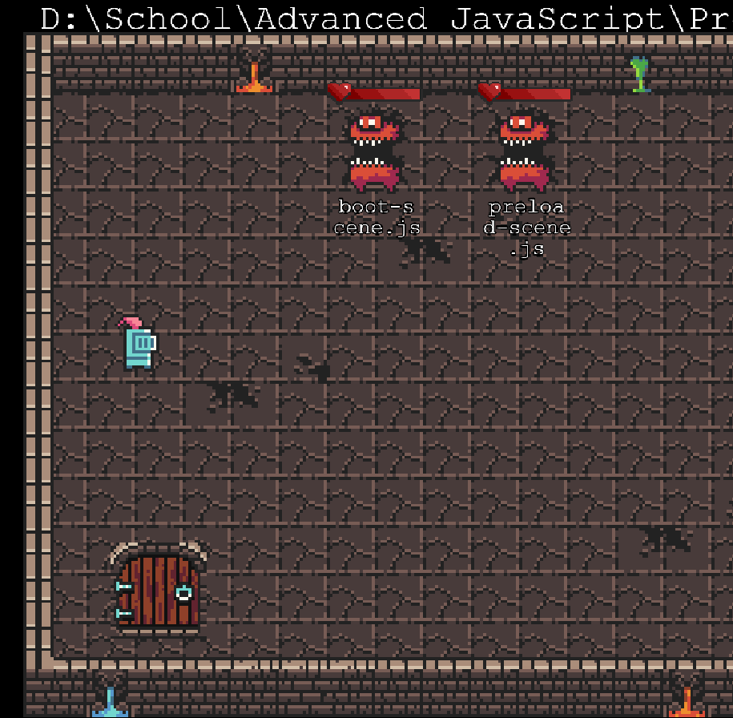

# File Explorer
This file explorer is used to navigate through directories and has all the basic functionalities of a normal file explorer.
It includes the ability to cut, copy, paste, delete files as well as delete folders. The player is able to enter any directory he pleases.

## Installation
To install all of the dependencies just use the following command:

`npm install`

## Launch
To launch the file explorer just use the following command in the directory of the file explorer:

`npm start`

## Built With

* [Phaser3](https://github.com/photonstorm/phaser) - Phaser is a fun, free and fast 2D game framework for making HTML5 games for desktop and mobile web browsers, supporting Canvas and WebGL rendering
* [Electron](https://github.com/electron/electron) - Build cross-platform desktop apps with JavaScript, HTML, and CSS 

## Author
* Denislav Tsonev